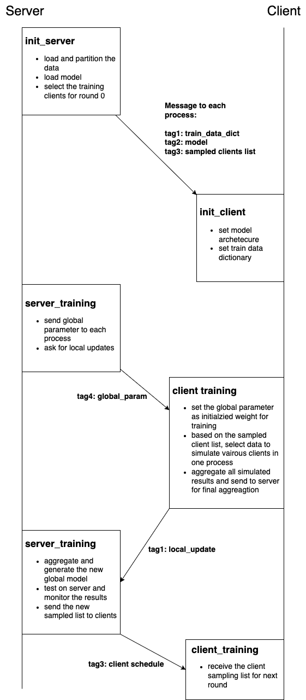

# EasyFL
A lightweight FL simulator for acedemic usage

## Overview
EasyFL is a simple MPI-based FL simulator. The structure only consists two classes: server class and client class. The server is fixed at process 0. Each client process could simulate multiple clients and run sequential training to minimize the memory cost. 

The communication message flow is shown below:
<div align="center">
 
</div>

## Server and Client Simulation
### Server Class
The server class (EasyFL/server/server_sim.py) is responsible for data loading, model loading, client selection and model aggregation. To initialize the server, it takes the aggregator class (EasyFL/server/aggregation.py) as input, which allows users to customize the aggregation function.

Inside the server class, data_loading function reads the customized dataloader, model_loading function reads the customized machine learning model, and client_sampling function provide the rule for select trainable clients. In server training function, it would take the customized aggregation function as input to generate new global model. Users could use these above functions to design and implement their own algorithms.

As we shown in the message flow, in the initialization phase, the server would send the partioned dataset with whole clients information, machine learning model, and sampled client schedule to each process. During the training, the server would send the global model parameters to each process and wait for their updates. After collecting all local updates, the server would generate and test the global model, and return sampled clients list to each process for the next round training.

### Client Class
The client class (EasyFL/client/client_sim.py) is only responsible for local model training. It takes the model trainer as input, in which users could customize their own local trainer. 

## Example
We take cifar10 with resnet20 as an example. The aggregator is FedAvg.
### Dataloader
The cifar10 dataloader is inside EasyFL/data/cifar10/data_loader.py. We ask each dataloader to output as the following: 
- __train_data_num__: total data sample number of the train data
- __test_data_num__: total data sample number of the test data
- __train_data_global__: train data without partition
- __test_data_global__: test data on server without partition
- __data_local_num_dict__: train data sample number for each client
- __train_data_local_dict__: train data loader dictionary for each client. Key is the client index and value is the pytorch dataloader.
- __test_data_local_dict__: test data loader dictionary for each client. Key is the client index and value is the pytorch dataloader.
- __class_num__: class number of the data
### Run the code
```
cd easyfl
bash run_main.sh 128 64 8 100 64 0.1
```
