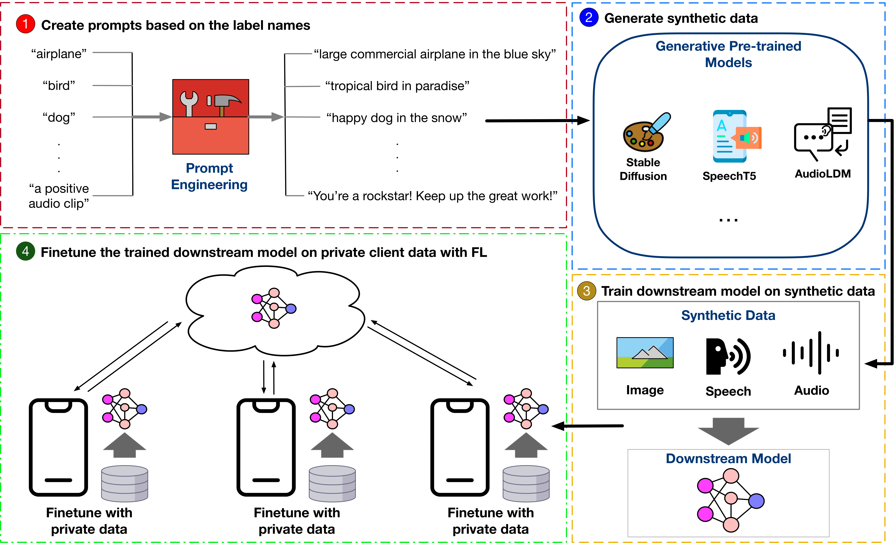

# GPT-FL: Generative Pre-Trained Model-Assisted Federated Learning

## Table of Contents
* Overview
* Installation
* Usage
* Contact

## Overview
In this work, we propose GPT-FL, a generative pre-trained model-assisted FL framework that effectively addresses the issues of existing methods. The key idea behind GPT-FL is to leverage the knowledge from the generative pre-trained models and to decouple synthetic data generation from the federated training process. 
Specifically, GPT-FL prompts the generative pre-trained models to generate diversified synthetic data. These generated data are used to train a downstream model on the server in the centralized manner, which is then fine-tuned with the private client data under the standard FL framework. 
By doing this, the proposed GPT-FL is able to combine the advantages of previous methods while addressing their limitations.

Paper Link: https://arxiv.org/abs/2306.02210

The GPT-FL package contains:
* Data generation pipelines with foundational models (e.g., StableDiffusion, SpeechT5, etc).
* Synthetic data training module for generating downstream models.
* A simple federated learning simulator with popular aggregation functions.

<div align="center">
 
</div>

## Installation
To begin with, please clone this repo and install the conda environment:
```
git clone https://github.com/zhang-tuo-pdf/GPT-FL.git
cd GPT-FL
conda env create -f environment.yml
conda activate SyntheticData
```

## Usage
### Create prompts based on the label names
The initial phase of the GPT-FL package is dedicated to the generation of synthetic data for downstream model training. This process begins with the creation of prompts derived from specified label names. For example, using the CIFAR-10 dataset as a reference point:
```
cd synthetic_data_generation
python text_gen.py cifar10 200
```
In the text_gen.py file, we leverage [Google's T5 fine-tuned on CommonGen for Generative Commonsense Reasoning](https://huggingface.co/mrm8488/t5-base-finetuned-common_gen) as the prompt generator. Users are encouraged to experiment with alternative models to potentially enhance prompt quality.

Furthermore, our methodology includes the utilization of ChatGPT 3.5 to craft high-quality prompts, as demonstrated by the following question-and-answer example aimed at generating image descriptions:
```
Q: " _ _ _ _ airplane _ _ _ _" Please fill in the blank and make it as a prompt to generate the image
A: Large commercial airplane in the blue sky.
```

### Generate synthetic data
#### Image generation
In this project, we use the [stable-diffusion-2-1](https://huggingface.co/stabilityai/stable-diffusion-2-1) as an image data generator. Currently, the pipeline supports generating synthetic datasets for CIFAR-10, CIFAR-100, Flowers102, Food101. For example, generating synthetic CIFAR-10 is:
```
python generate_image.py 5 0 syn_dataset class_prompt cifar10
```
The generate_image.py script accepts five principal arguments, detailed as follows:
* gpu_number: Denotes the total number of GPUs allocated for the task. The script distributes the image generation workload evenly across the specified GPUs to enhance efficiency.
* device_num: Specifies the individual GPU to be utilized for the current execution.
* save_path: Indicates the directory path where the generated images will be stored.
* generate_method: Applicable exclusively for generating the Food101 dataset.
* dataset: Specifies the target dataset for which synthetic images will be generated.

In adherence to the principles of parallel computing, the naming convention for each generated image is structured as follows: args.save_path + '/' + class_name + '_train_' + str(device_num) + '_' + str(j) + '.png'. This format supports seamless parallel dataset generation across multiple GPUs. For instance, to generate a dataset utilizing two GPUs, the commands can be executed in parallel as shown:
```
# For GPU 0 (Process 1)
python generate_image.py 2 0 syn_dataset class_prompt cifar10
# For GPU 1 (Process 2)
python generate_image.py 2 1 syn_dataset class_prompt cifar10
```

#### Speech/Spoken Words generation
In the spoken word generation, we utilized [speecht5-tts](https://huggingface.co/microsoft/speecht5_tts) to generate the speech. We manually add the 35 unique spoken words from the Google Speech Commands dataset in the generation script. We want to highlight that the user can re-use the pipeline to generate any English speech by modifying the input in the generation in synthetic_data_generation/generate_gcommands.py. To perform the generation, run the following:

```
cd synthetic_data_generation
python generate_gcommands.py --gpu_number 5 --device_num 0 --save_path ../syn_dataset --generate_method multi_speaker
```
The generate_gcommands.py script accepts the following arguments:
* gpu_number: Denotes the total number of GPUs allocated for the task. The script distributes the speech generation workload evenly across the specified GPUs to enhance efficiency.
* device_num: Specifies the individual GPU to be utilized for the current execution.
* save_path: Indicates the directory path where the generated speech will be stored.
* generate_method: Class prompt-The input is the spoken word; Multi-speaker-The input is the spoken word and augmented with speaker embedding sampled from Matthijs/cmu-arctic-xvectors huggingface dataset;


#### Audio generation
In the audio generation, we utilized [audioldm](https://huggingface.co/cvssp/audioldm) to generate the audio sound. The user needs to download [ESC50](https://github.com/karolpiczak/ESC-50/tree/master) before the generation, as the script requires the reading the groundtruth csv from this dataset. We want to highlight that the user can re-use the pipeline to generate audio sounds from other datasets by inputing the correct domain list. To perform the generation, run the following:

```
cd synthetic_data_generation
python generate_esc50.py --gpu_number 5 --raw_data_dir ../ESC-50-master --device_num 0 --save_path ../syn_dataset --generate_method class_prompt
```
The generate_esc50.py script accepts the following arguments:
* gpu_number: Denotes the total number of GPUs allocated for the task. The script distributes the audio generation workload evenly across the specified GPUs to enhance efficiency.
* device_num: Specifies the individual GPU to be utilized for the current execution.
* raw_data_dir: Indicates the directory path where the raw ESC50 dataset will be stored.
* save_path: Indicates the directory path where the generated audio will be stored.
* generate_method: Class prompt-The input is the class name; multi-domain adds the sound context, like in the studio, on top of class prompt; ucg adds randomness in the generation by controling guidance scales on top of class prompt;


### Train downstream model on synthetic data
Our package includes a centralized training module, encapsulated within the training_main.py script, specifically designed for training on synthetic image datasets. Please refer to [FedAudio](https://github.com/zhang-tuo-pdf/FedAudio) package for synthetic audio training.

Given the substantial volume of synthetic data generated, direct uploading to this repository or other cloud storage services is impractical. If the synthetic dataset utilized in our study sparks your interest, we invite you to contact us via email for detailed discussions and potential access.

Instead, we release the weight of the downstream model that was trained with synthetic data. Specifically, these weights correspond to a model trained on a dataset threefold the size of its real-data counterpart (denoted as "3x Synthetic" within our publication). 
To procure these weights, execute the command below:
```
bash weight_download.sh
```

### Finetune the trained downstream model on private client data with FL
Leveraging the provided model weights, users have the flexibility to select any FL library of their choice for the fine-tuning process. One only needs to load the downstream model weight as the initialization weight for FL training.

We provide a simple FL simulator named EasyFL to reproduce the results we shown in the paper. Detailed information about the EasyFL package and its functionalities can be found within its accompanying [README](https://github.com/zhang-tuo-pdf/GPT-FL/blob/main/EasyFL/README.md) document.

For the image-related experiments, specifics regarding the integration of the GPT-FL framework, including how the model weights and datasets are orchestrated, can be found [here](https://github.com/zhang-tuo-pdf/GPT-FL/blob/main/EasyFL/server/server_sim.py#L219).

Please refer to the [FedAudio](https://github.com/zhang-tuo-pdf/FedAudio?tab=readme-ov-file#linkage-with-gpt-fl) package for the audio-related experiments.


## Contact
If you like our works, please cite our paper in your publications.
```
@article{Zhang2023GPTFLGP,
  title={GPT-FL: Generative Pre-trained Model-Assisted Federated Learning},
  author={Tuo Zhang and Tiantian Feng and Samiul Alam and Mi Zhang and Shrikanth S. Narayanan and Salman Avestimehr},
  journal={ArXiv},
  year={2023},
  volume={abs/2306.02210},
  url={https://api.semanticscholar.org/CorpusID:259075747}
}
```

```
@article{Zhang2022FedAudioAF,
  title={FedAudio: A Federated Learning Benchmark for Audio Tasks},
  author={Tuo Zhang and Tiantian Feng and Samiul Alam and Sunwoo Lee and Mi Zhang and Shrikanth S. Narayanan and Salman Avestimehr},
  journal={ICASSP 2023 - 2023 IEEE International Conference on Acoustics, Speech and Signal Processing (ICASSP)},
  year={2022},
  pages={1-5},
  url={https://api.semanticscholar.org/CorpusID:253224220}
}
```
Feel free to contact us!

Tuo Zhang tuozhang@usc.edu

Tiantian Feng tiantiaf@usc.edu


